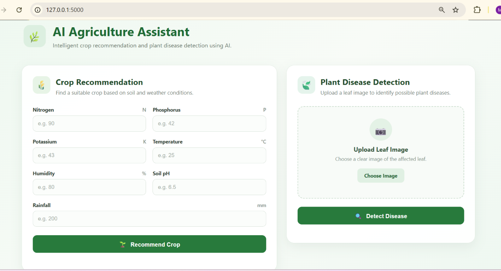
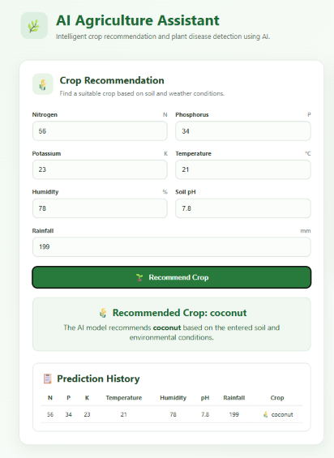
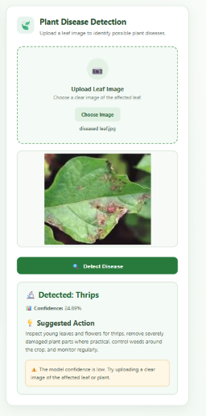

# AI-Based Smart Agriculture System for Crop Recommendation and Plant Disease Detection

## Overview

The AI-Based Smart Agriculture System is a machine learning and deep learning web application designed to assist users with two agriculture-related tasks:

1. Crop Recommendation based on soil and environmental conditions.
2. Plant Disease Detection from an uploaded plant image.

The application provides a simple web interface where users can enter agricultural parameters or upload a plant image and receive an AI-based result.

## Features

### Crop Recommendation

The system recommends a suitable crop using:

- Nitrogen (N)
- Phosphorus (P)
- Potassium (K)
- Temperature
- Humidity
- Soil pH
- Rainfall

A trained Random Forest model is used for crop prediction.

### Plant Disease Detection

The system accepts an uploaded plant image and predicts one of the following classes:

- Anthracnose
- Aphids
- Fall Armyworm
- Healthy
- Leaf Curl Virus
- Mites
- Mosaic Virus
- Powdery Mildew
- Shoot and Fruit Borer
- Thrips

A MobileNetV3-Small based deep learning model is used for image classification.

The application also provides a basic suggestion associated with the predicted disease.

## Technologies Used

- Python
- Flask
- Flask-CORS
- HTML
- CSS
- JavaScript
- Scikit-learn
- PyTorch
- Torchvision
- Pandas
- NumPy
- Pillow
- Matplotlib
- Joblib

## Project Structure

```text
AI_Agriculture_Project/
│
├── backend/
│   └── app.py
│
├── dataset/
│   └── Crop_recommendation.csv
│
├── models/
│   ├── crop_recommendation_model.pkl
│   ├── features.pkl
│   ├── disease_classes_finetuned.json
│   └── disease_mobilenetv3_finetuned.pth
│
├── static/
│   ├── script.js
│   └── style.css
│
├── templates/
│   └── index.html
│
├── train_disease_model.py
├── evaluate_disease_model.py
├── prepare_disease_dataset.py
├── clean_disease_duplicates.py
├── inspect_disease_dataset.py
├── check_disease_dataset.py
├── check_disease_counts.py
├── check_disease_quality.py
├── check_disease_splits.py
├── check_original_disease_counts.py
├── inspect_disease_predictions.py
├── preview_disease_dataset.py
├── create_disease_contact_sheets.py
├── .gitignore
├── requirements.txt
└── README.md
## Screenshots

### Main Interface


### Crop Recommendation


### Plant Disease Detection

